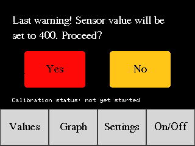
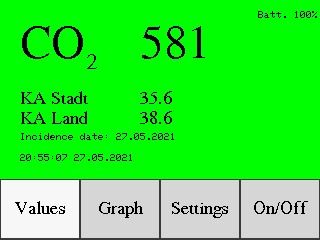
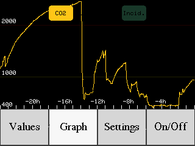
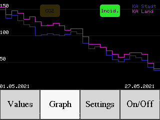
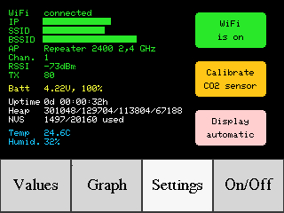
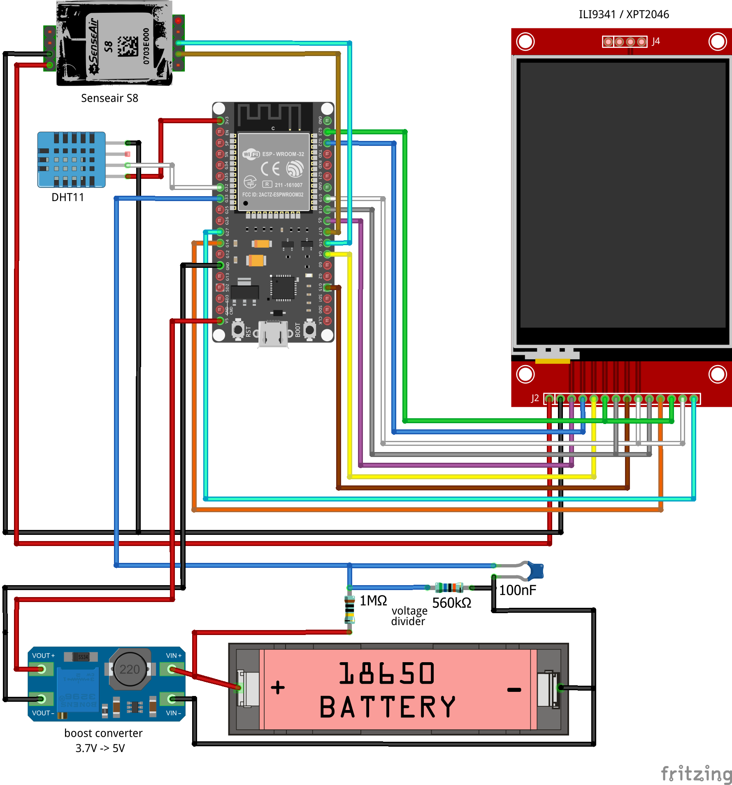

# CO2 monitor
This project is an ESP32 based CO2 monitor using a SenseAir S8 sensor. Some additional features like graphs, touch screen, and MQTT support were added to have a fully functional device. The full feature list is:
- graphical presentation of CO2 measurements from last 24h
- support for calibrating the SenseAir S8
- MQTT support
- auto turn on display if CO2 thresholds are reached (1000 ppm and 2000 ppm), display background becomes green/yellow/red according to CO2 measurement
- touch display
- keeps data (CO2 and incidences) in permanent storage, data is not lost after reboot
- special to Germany: retrieving 7-day-incidence for your region from the RKI (Robert-Koch-Institut)
- temperature and humidity measurement with DHT11
- works both online and offline
- OTA (over the air) updates for firmware, no need for serial connection (only for first flashing)
- battery board with single LiIon 18650, battery monitoring
- REST API for maintaining incidence and CO2 measurements
- 3D printed housing
- bonus: REST API endpoint for taking screenshots

<a href="https://github.com/KlausMu/esp32-co2monitor/raw/main/images/housing_closed"></a>

## Credits
Most ideas used here were inspired by the <a href="https://www.youtube.com/channel/UCu7_D0o48KbfhpEohoP7YSQ">YouTube Channel of Andreas Spiess</a> which I highly recommend if you are interested in microcontrollers and sensors. 

## Table of Contents
  * [Measuring CO2 with SenseAir S8](#measuring-co2-with-senseair-s8)
    * [Calibrating SenseAir S8](#calibrating-senseair-s8)
  * [COVID-19 Incidences](#covid-19-incidences)
  * [Graphs](#graphs)
  * [Permanent storage](#permanent-storage)
  * [Temperature and Humidity](#temperature-and-humidity)
  * [Power supply](#power-supply)
    * [Voltage monitoring](#voltage-monitoring)
  * [WiFi](#wifi)
  * [MQTT](#mqtt)
  * [REST API](#rest-api)
  * [Real time](#real-time)
  * [Translations](#translations)
  * [Internal details and settings](#internal-details-and-settings)
  * [OTA](#ota)
    * [Serial logging](#serial-logging)
  * [Housing](#housing)
  * [Wiring diagram](#wiring-diagram)
  * [Part list](#part-list)
  * [Software installation](#software-installation)

## Measuring CO2 with SenseAir S8
I know three different NDIR infrared sensors capable to measure CO2:
- Winsen MH-Z19: cheap, but a lot of fake sensors seem to be sold
- Sensirion SCD-30: good, but expensive
- SenseAir S8: cheap, well documented

Please also see these videos from Andreas Spiess:
- <a href="https://www.youtube.com/watch?v=hcPdZlpaRTo">#358 CO2 Cuckoo Clock for schools and businesses (Why not eCO2?)</a> 
- <a href="https://www.youtube.com/watch?v=FL0L-nic9Vw">#300 How to measure CO2 and VOC with Arduino. Which one is better?</a> 

So I tried my luck with the SenseAir S8. This sensor uses serial communication. The used Modbus protocol is well documented <a href="https://rmtplusstoragesenseair.blob.core.windows.net/docs/Dev/publicerat/TDE2067.pdf">and available via PDF</a>.

There is even a <a href="https://senseair.com/media/2001/uip5_0_0_3_40_setup.exe">standalone software called UIP5</a> available from SenseAir for the S8. You only need an FTDI adapter or a special test board which is available for the SenseAir S8.

The S8 is available in different flavors (see <a href="https://senseair.com/products/size-counts/s8-residential/">this page</a> on tab "variations"). I took the <a href="https://senseair.com/products/size-counts/s8-lp/">004-0-0053</a>. According to the datasheet measurement range is from 400-2000 ppm, but the sensor reports even 3000 ppm and more. I guess only precision is best between 400 and 2000, which perfectly fits to normal use.

### Calibrating SenseAir S8
As you might now, CO2 concentration is measured in ppm. All the NDIR infrared sensors I know need to be calibrated from time to time. All these sensors have autocalibration, which is ok, but the autocalibration process takes some days or even weeks to work fine.

As far as I understand, autocalibration works quite simple: as soon as values below 400 are measured, the sensor adjusts itself, as values below 400 don't exist in normal life. In the other direction autocalibration works probably similar: if you never get values close to 400, your sensor needs to be adjusted to provide lower values.

An easy way to calibrate your sensor is to go outside to fresh air where CO2 concentration should be 400 ppm, wait one or two minutes and then to tell your sensor to calibrate to 400 ppm.

You can do this by selecting "Settings - Calibrate CO2 sensor" on the display.



## COVID-19 Incidences
In Germany, the Robert Koch Institut provides every day the so called COVID-19 7-day-incidence for every region. Values are provided by an API which can be used by everyone without charge.

If you want the CO2 monitor to get the incidence and show it on the display, you only need to know the ID of your region. This ID can be found here:
https://npgeo-corona-npgeo-de.hub.arcgis.com/datasets/917fc37a709542548cc3be077a786c17_0
In the map, click on your region and look for the value "ObjectID" in the table. Put this value in file "incidenceMap.cpp". You can even provide two or more regions.

If you are not in Germany or do not want to use the incidences, simply comment
```
#define useIncidenceFromRKI
```
in file "config.h".



## Graphs
Graphs both for CO2 values and incidences are provided. CO2 values will be shown for the last 24 hours. Incidences are shown as much as available.




## Permanent storage
In order to keep values from the CO2 sensors and incidents even after the ESP32 reboots, the NVS (nonvolatile storage) from the ESP32 is used. Unfortunately, the standard NVS partition has only 20.480 bytes size and can only hold 630 values. The ESP32 (and especially WiFi) already takes approx. 280 of them. So only 350 are left. To less for us.

This is the reason why most software developers create their own NVS partition with which they can do whatever they want. The new partition scheme is in file "partitions_custom.csv". The custom partition I am using has 655.360 bytes size and can hold 20.160 values.

For getting space for the custom NVS partition I reduced the application partitions a little bit and drastically reduced the size of the SPIFFS partition.

If you are using PlatformIO, the custom partition scheme is automatically used when uploading to the ESP32.
If you are using the Arduino IDE, please have a look <a href="https://robotzero.one/arduino-ide-partitions/">here</a> on how to use a custom partition scheme.

You will not change your ESP32 in a non-reversible way when using this custom partition scheme. The <a href="https://github.com/espressif/arduino-esp32/blob/master/tools/partitions/default.csv">default scheme</a> will automatically be applied if you ever upload a different project to your ESP32.

## Temperature and Humidity
I used a DHT11 for measuring temperature and humidity. Unfortunately, temperature raises significantly when charging the battery, so I wouldn't use a temperature sensor any more.

## Power supply
Inspired by the video <a href="https://www.youtube.com/watch?v=joAkJ9QA2bw">#250 Universal Power Source (UPS) for only 2$. Is this possible? (Raspberry Pi, Arduino, ESP32)</a> from Andreas Spiess, I used a smart and versatile power source with a single 18650 LiIon battery. The board can both deliver 5 V and 3.3 V and can charge the battery. Perfect. (Drawbacks of the board are stated in the video).<br>
<a href="https://github.com/KlausMu/esp32-co2monitor/raw/main/images/battery-board.png"></a>

With TFT turned off, one 18650 can power the device for about 15h, with TFT turned on about 8h. Both with WiFi enabled. I didn't test it with WiFi disabled.

### Voltage monitoring
Knowing the state of the battery is always helpful. Since the ESP32 cannot directly measure up to 4.2 V, a simple voltage divider is used. Additionally, I used a filter capacitor, but probably it works without it.

Reading analogue values with an ESP32 unfortunately isn't very precise. You always must calibrate it, which can easily be done. If you don't worry too much about precision, it is sufficient to only calibrate your reading at one single voltage level.

If you want to have more precision, then you must deal with the ESP32 non-linearity issue. This means you cannot simply do linear calculations to get correct measurements. You can use the approach from <a href="https://github.com/e-tinkers/esp32-adc-calibrate">here</a> to generate a lookup table specific for your ESP32 to correct non-linear errors.

The lookup table in the code fits to my ESP32 and most likely will not perfectly fit to your ESP32.

For more details on how to calibrate see file "liIonVoltage.cpp".

## WiFi
It is highly recommended to use WiFi. With WiFi enabled you can
- publish CO2 measurements via MQTT
- retrieve incidences from RKI (only Germany)
- get real time via NTP
- use the REST API
- use OTA

Please adjust your WiFi settings in file "config.h"

I have several WiFi Access Points and Repeaters in my house, and I like to know to which AP or Repeater and on which frequency (channel and 2.4/5GHz) the ESP32 is connected. For that the function "void setAccessPointName()" is available. Please adjust this to your needs, if you want to. Sometimes it is hard to know the MAC addresses of your AP or Repeater. The easiest way to find this out is most likely the administration page of your AP/repeater.

## MQTT
There are three state topics available where the CO2 monitor sends its state every 10 seconds.
Topic | Example
------------ | -------------
esp32_co2/tele/STATE1 | { "co2": 1078, "co2status": 0, "temp": 29.6, "hum": 26, "volt": 4.16, "battstate": 100 }
esp32_co2/tele/STATE2 | { "wifiRSSI":-62,"wifiChan":1,"wifiSSID":secret,"wifiBSSID":AA:BB:CC:DD:EE:FF }
esp32_co2/tele/STATE3 | { "up": 902897, "heapSize": 300812, "heapFree": 124012, "heapMin": 70548, "heapMax": 67188, "nvsUsed": 1503, "nvsTotal": 20160 }

Please adjust your MQTT server settings in file "config.h"

## REST API
A simple REST API is available, which is probably almost self-explaining. It is intended for maintaining the values in the permanent storage, which you cannot simply delete by rebooting the ESP32.

Function | Example | Remark
------------ | ------------- | -------------
Get all CO2 values | http://\<IPaddress\>/co2values?pageno=00&pretty=1 | 0 <= pageno <= 14, each page has 100 values<br>only available if real time is set
Delete single CO2 value | curl "http://\<IPaddress\>/co2values" -X DELETE -d "{ \"dateTime\": \"2021-05-22 19:10:00\"}" -H "Content-Type: application/json" | only available if real time is set
Get all incidences for a region | http://\<IPaddress\>/incidence?pageno=00&regionID=193&pretty=0 | each page has 100 values 
Delete single incidence for a region | curl "http://\<IPaddress\>/incidence" -X DELETE -d "{\"regionID\": 193, \"date\": \"2021-05-23\"}" -H "Content-Type: application/json" |
Put single incidence for a region | curl "http://\<IPaddress\>/incidence" -X PUT -d "{\"regionID\": 194,\n\"date\": \"2021-05-23\",\n\"value\":68.1}" | only use regions which are known to the firmware
Get screenshot | http://\<IPaddress\>/screenshot |

For using endpoints which need body data (DELETE, PUT), either use curl as in the example, or a tool like <a href="https://install.advancedrestclient.com/install">Advanced REST Client</a>

## Real time
I'm using the fantastic library <a href="https://github.com/ropg/ezTime">ezTime</a> which can retrieve NTP network time and supports timezones. By default, I'm using timezone "Europe/Berlin". Please adjust this to your needs in the file "config.h"
```
#define myTimezone                 "Europe/Berlin"
```

## Translations
Two translation files are provided
- English: lang\en.h
- German: lang\de.h

In file "config.h" you can define which one is used.
```
#include "lang/en.h"
```
I would be happy if you create more translation files and send me a pull request.

## Internal details and settings
On screen "Settings" you can
- see details about your WiFi connection
- enabled and disable WiFi
- see details about your battery state
- see how long your ESP32 is running
- see how much heap is free (HeapSize, FreeHeap, MinFreeHeap, MaxAllocHeap)
- see how many entries of the permanent storage is used
- see temperature and humidity
- start SenseAir S8 calibration
- set if the display should always stay off or if it should be turned on when a CO2 threshold is reached (1000 for yellow or 2000 for red)



## OTA
If you want to upload new firmware OTA (over the air, which means without serial connection), activate
```
#define useOTAUpdate
```
in the file "config.h".

Please note that for uploading the first time you have to use a serial connection!

For more details about what OTA is and how to use, please see this video from Andreas Spiess: <a href="https://www.youtube.com/watch?v=1pwqS_NUG7Q">#332 ESP32 OTA tutorial with tricks (incl. OTA debugging)</a> 

If you want to upload a new firmware, use these two lines in file "platform.ini":
```
upload_protocol = espota
upload_port = <ip-adress of your ESP32, see serial log>
```
On how to do it with the Arduino IDE, see the video above.

I recommend to activate OTA only when needed for uploading a new firmware. As soon as you activate OTA it takes about 10K of heap space, which leads to an unstable ESP32 (reboot after some days, hours or even minutes, usually when receiving a WiFi packet).
It seems the the CO2 monitor already needs a lot of heap space for normal operation.
Activate OTA via sending a MQTT message to "esp32_co2/cmnd/OTA" with payload "ON" and then upload the new firmware.

Same holds for using a seperate thread for checking for OTA updates. Creating a seperate thread for this takes also about 10k of heap space, so I don't recommend it. I had instability issues when doing it that way. It's also fine to check for OTA updates in the main loop.

### Serial logging
If you have no serial connection, how can you get debug messages? For this I'm using the library <a href="https://github.com/jandrassy/TelnetStream">jandrassy/TelnetStream</a>. Instead of using "Serial.print(...)" you simply use "TelnetStream.print(...)". Then you can use a telnet connection to your ESP32 to get debug messages.

But what if you sometimes want to have debug messages via serial connection and sometimes via TelnetStream? Always changing the code from "Serial.print(...)" to "TelnetStream.print(...)" and back is not a good solution. For this I created a class called "LogStreamClass". Now in your code you can simply write "Log.printf(format, ...)". In "config.h" you can define one or both of
```
#define useSerial
#define useTelnetStream
```
No need to change the code.

## Housing
STL and STEP files for a housing are in folder "housing". Of course, it only fits if you use exactly the same components as I did. By adjusting the STEP file, you should be able to do some changes if you need to.

<a href="https://github.com/KlausMu/esp32-co2monitor/raw/main/images/housing-inner1.jpg"></a>
<a href="https://github.com/KlausMu/esp32-co2monitor/raw/main/images/housing-inner2.jpg"></a>

## Wiring diagram

<a href="https://github.com/KlausMu/esp32-co2monitor/raw/main/images/housing_open.jpg"></a>

## Part list
Function | Parts | Remarks | approx. price
------------ | ------------- | ------------- | -------------
CO2 sensor | SenseAir S8 004-0-0053| <a href="https://de.aliexpress.com/item/4000783293177.html">AliExpress</a> | 26 EUR
TFT display with touch | 2.8 inch 320x240, ILI9341 / XPT2046 | <a href="https://www.aliexpress.com/item/32617643223.html">AliExpress</a> | 10 EUR
Microcontroller | ESP32 | <a href="https://www.aliexpress.com/item/32896618772.html">AliExpress</a> | 5 EUR
Battery charge board | 18650 | <a href="https://de.aliexpress.com/item/32870411748.html">AliExpress</a> | 5 EUR
On/off switch | whatever you like | <a href="https://de.aliexpress.com/item/32806570916.html">AliExpress</a> | 3 EUR
Temperature sensor | DHT11 | <a href="https://www.aliexpress.com/item/1059518033.html?">AliExpress</a> | 2.50 EUR
Voltage divider | resistor 1 MOhm, 560 kOhm<br>optional: ceramic capacitor 100 nF | | cents

## Software installation
If you are only used to the Arduino IDE, I highly recommend having a look at <a href="https://platformio.org/">PlatformIO IDE</a>.

While the Arduino IDE is sufficient for flashing, it is not very comfortable for software development. There is no syntax highlighting and no autocompletion. All the needed libraries must be installed manually, and you will sooner or later run into trouble with different versions of the same library.

This cannot happen with <a href="https://platformio.org/">PlatformIO</a>. All libraries will automatically be installed into the project folder and cannot influence other projects.

If you absolutely want to use the Arduino IDE, please have look at the file "platformio.ini" for the libraries needed. Also read <a href="https://robotzero.one/arduino-ide-partitions/">here</a> on how to use the custom partition scheme "partitions_custom.csv" needed by the CO2 monitor (see "Permanent storage" above).

For installing PlatformIO IDE, follow this <a href="https://docs.platformio.org/en/latest/integration/ide/vscode.html#installation">guide</a>. It is as simple as:
* install VSCode (Visual Studio Code)
* install PlatformIO as an VSCode extension
* clone this repository or download it
* use "open folder" in VSCode to open this repository
* check settings in "config.h"
* upload to ESP32
